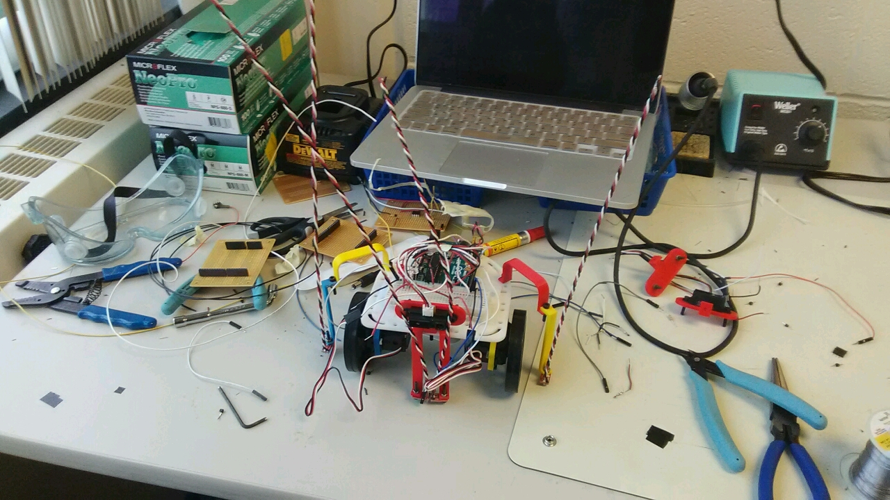
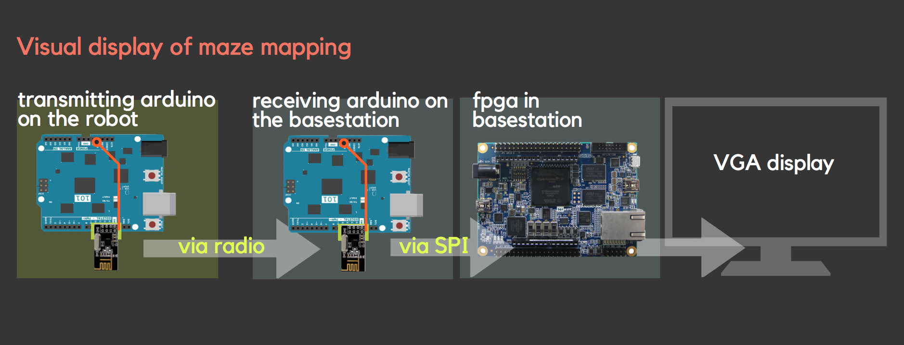
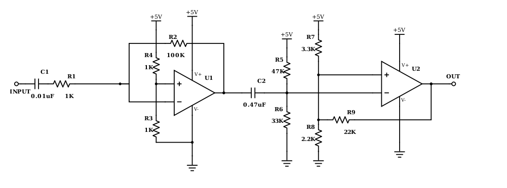
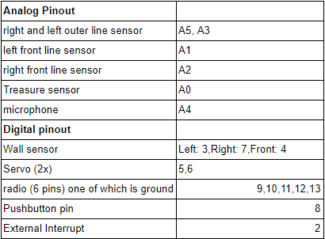

## Introuduction
During the last week of the semester we were mainly focused on redesigning some of our robot's hardware components, adding additional components and merging the systems together to be ready for the competition. Our robot has a tower like design with separate hardware components that include amplifiers, schmitt trigger, and powering components. On the software side the major components were DFS, treasure detection, start signal, radio communication and FPGA code. Merging all these was the biggest challenge for our team. 

## Redesigning the robot
We've consolidated all of our hardware on 5 different breadboards stacked up. The first breadboard contains hardware for the servos, the second breadboard contains hardware for the wall sensors, the third breadboard contains hardware for our line sensors and treasure detection passive mixer, the fourth one is a Schmitt trigger and amplifier for our treasure sensors and our last breadboard contains the mic, mic amplifier and a push-button.

Here is the top-down look at our final design:

### first breadboard

The first breadboard contains hardware for the servos. Since we switched often from 5V and 9V batteries, we made a circuit to provide both options. Since the servos can only take 5V, we also used a regulator in the case that the 9V battery is used.

### second breadboard

The second breadboard contains our hardware for our wall sensors. We used short range sensors for our wall sensors and in the beginning the sensors had to be considerably close to the walls to detect them, so we added circuitry to amplify the signal so that the robot could detect the wall from further away. Specifically, we wanted to be able to detect the walls at each intersection.

### third breadboard

The third breadboard, as mentioned before, has hardware for the line sensors and treasure detection. In order to save pins, we consolidated the left and right outer line sensors into one input into one arduino pin. Since our code only cares about when both of the left and right outer line sensors are high and detect something, we used an and gate. For treasure detection we used a passive mixer.

### fourth breadboard

The fourth breadboard had our Schmitt trigger on it, to prevent the issue with fft. The output from the passive mixer inputs into the Schmitt trigger and a highpass filter, which would then output into the arduino, using only one pin.

### fifth breadboard

The fifth and last breadboard has our mic, mic amplifier and push button. The mic for the starting signal needed to be amplified so we created a simple circuit to do so and mounted it onto the top board and connected it with the mic. We also had the push button is our backup robot starting switch to manually start the robot if in case our mic system fails to detect 600Hz and set the robot into motion. 

The sensors are located around the perimeter of the robot with line sensors and wall sensors and the treasure detectors. The sensors are then connected to the circuitry on the breadboard and then most of the circuitry on the breadboard connects as an output or input to the arduino.

Here is a detailed graphic about how all of the parts were integrated into the robot:

ON THE ROBOT:

BASESTATION SETUP:

## Detailed description of Hardware and software components
### Hardware

We experimented and used several different circuits to increase the efficency and increase the organization of our robot for simpler and easier usabiliy. These circuits included and gates for consolidating the line sensors, a schmitt trigger and passive mixer to consolidate our treasure detectors and prevent the problems with fft, physical amplifiers, manual starting with a pushbutton and more.

* **Mic amplifier**: we made a bandpass filter with gain using the PCB for the final system. Unfortunately, there were connection problems on the amplifier that prevented it from working properly. Based on the results we had from lab2 we were expecting to get an output of (?). Therefore we used the filter we made during lab2 for our final system. 

* **Push-button**: the push button is our backup robot starting switch if in case our mic system fails to detect 600Hz and set the robot into motion. It is made using a pulldown resistor which pulls the voltage down to near zero when an active device like a push button is not connected. 

* **Passive mixer for treasure sensors**: since the Arduino has only five pins we needed to figure out a way to limit the number of inputs that are needed to directly connect with the Arduino. The passive mixer helped us to combine the inputs from the three treasure sensors detecting signals from the front, left and right side of the robot. The passive mixer has an RC high pass filter that detects signals above 5.5kHz. The capacitor is also used to block the DC signal from the other two sensors when one of them are active. The output from each sensor is combined together. Two voltage divider resistors are used in order to set a reference voltage for the output.

* **Schmitt trigger**: our treasure sensors were first combined with the passive mixer which worked when they were tested without the merged code of the entire system. The fourier transform for the treasures and mic required us to implement interrupts in order to detect treasures while the robot is moving. We build an opamp based schmitt trigger which is built from a non-inverting opamp with positive feedback. It is a comparator circuit that works by converting inputs below and above the threshold value as logical inputs. Values below above a certain threshold can be set to high and those that are low can be set to zero. It allowed us to easily convert the noisy signals from our treasure sensors to a cleaner square wave. 

* **Highpass filter**: a high pass filter was used from the input end in order to avoid low frequencies that were adding more noise to our Schmitt trigger. Particularly a 120 Hz signal was triggering the Schmitt trigger which was interfering with the threshold voltage that sets the boundary for the low and high signal on the square waves. 

* **Amplifier for wall sensors**: Our wall sensors only detected walls only when the wall is very close. We needed the robot to detect walls from a distance that is approximately 15cm.Therefore, we made an inverter using a bipolar junction transistor that would take the voltage reading from the sensor which is in millivolts range and amplifies it 5 volts. This allowed us to detect the walls approximately from a distance of 15cm. Below is the schematic of the amplifier configuration.

### other implementations

Another implementation that simplified the design was using SPI for our arduino to FPGA communication. We chose to use SPI rather than parallel connections as many teams did to help save pins on the arduino.

Also to allow flexibility in powering the robot, we made a circuit that would allow for both 5V and 9V battery usage.

## Pin List
Below is a pin list for the robot. As mentioned above we used a passive mixer to save analog pins for detecting treasures. For two of the side line sensors that decect treasure, we built an and gate since we will be at an intersection only if both of the sensors are reading the same value corresponding to black line. However, the circuitry had connection and implementation problems. Since we had extra analog pin from our sensors, we decided to separate the readings from each side line sensor. 

## Final Problems 😢😢😢😢😢
Unfortunately, we were not able to complete our project due to several difficult issues. 

One of the largest problems we faced was with our VGA display. Although our VGA worked perfectly when we ran simulations by feeding input into the basestation arduino, the SPI and the radio code would not run concurrently leading to having no display for the final competition. Even communicating with the TAs could not fix the problem, and we lacked the time to fully correct it.

Our search algorithm was functional, however we had some glitches in certain scenarios which lead to it crashing into walls. This is often due to skipping intersections and not properly maintaining its state in the maze. Knowing the state of the maze is critical to the backtracking portion because it needs to know where to go in order to reach unvisited nodes. If the robot skips a square, this algorithm will fail. We tried debugging this by testing the robot on different mazes and testing the sensors and logic individually.

All of other components were tested to be fully functional, however, integrating them into one system was a major difficulty. For example, we could not use FFT on the start and treasure signals. This required us to spend a whole day redesigning the treasure detection system to use a comparator and interrupts.
