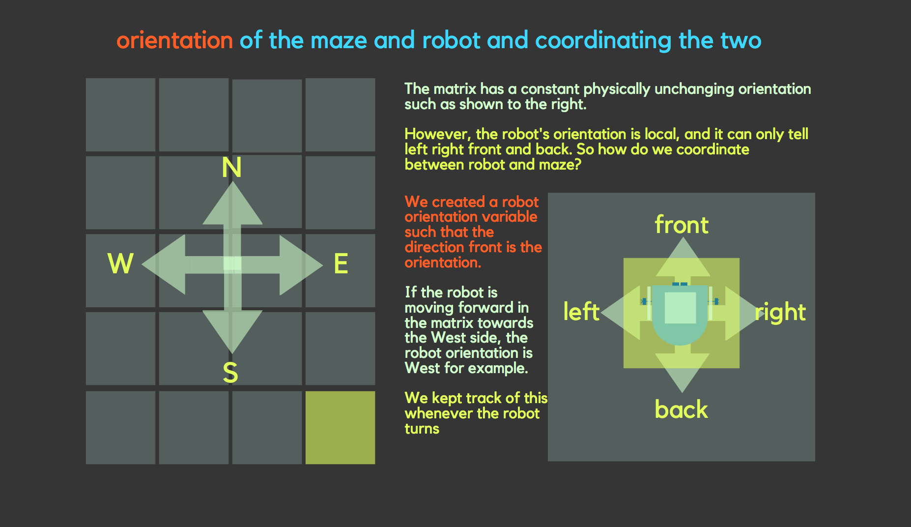
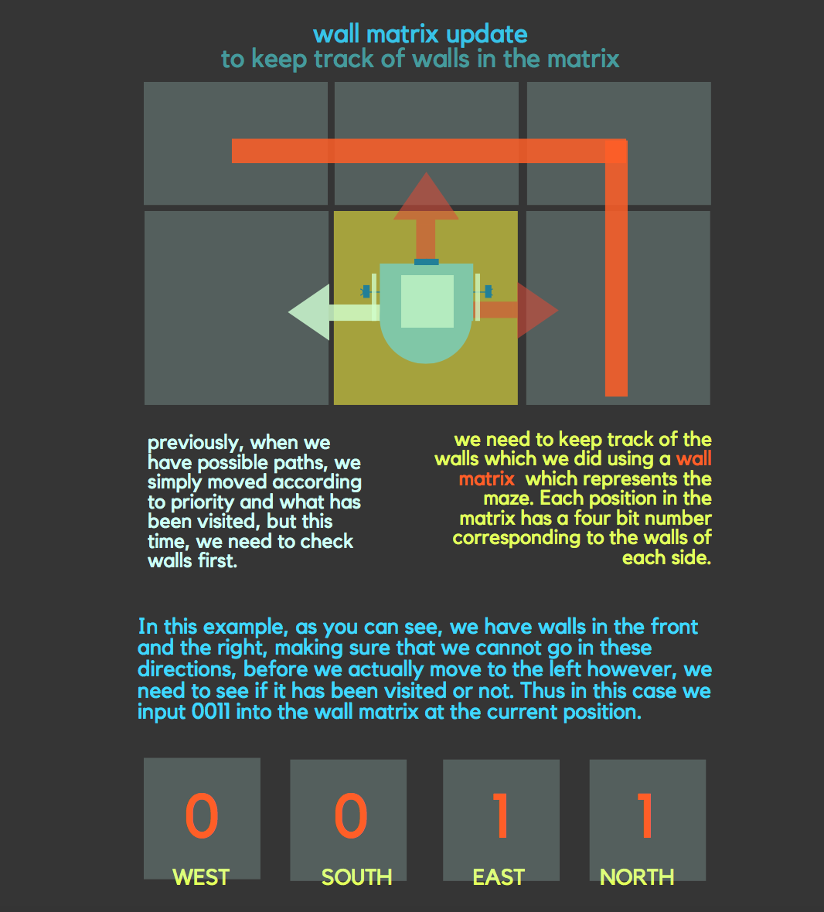
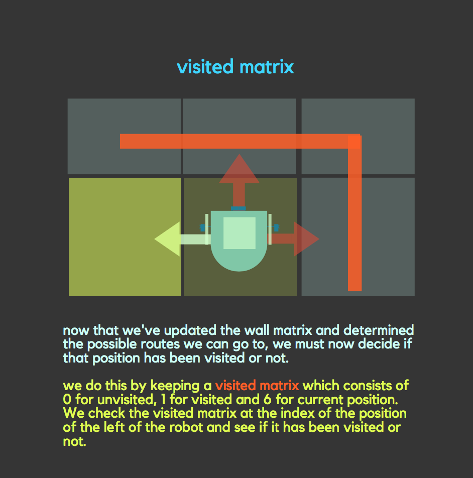
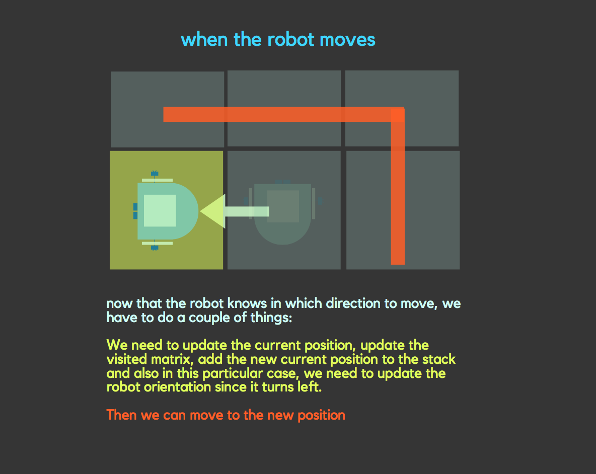
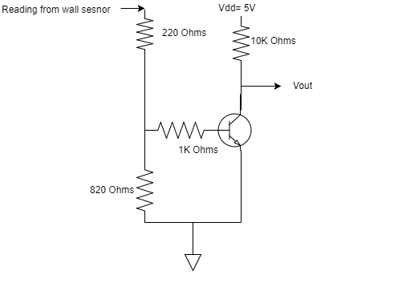

 
## Milestone 3
The purpose of this milestone was to simulate maze mapping, which is a large part of our final robot design. We first implemented this using a more flexible programming language, in our case, we used Python, so that we could simulate and easily test out the efficiencies of certain algorithms and so we could also easily test out different optimization techniques. Then we implemented this on the Arduino so that the robot can navigate through the maze.

We used Depth first search for our map mazing implementation. DFS as the name implies traverses the path until it finds the goal. In our case, even though there is no target specific target, the robot wants to traverse each location on the 4x5 maze unless it is a blocked area. The simulation implemented both DFS and BFS while the real code only involved DFS. We plan to scale up our the DFS algorithm into Dikjstra's algorithm so that our maze can make path choices that entail the cost of choosing one direction over the other.[Click here to learn more about DFS](https://www.hackerearth.com/practice/algorithms/graphs/depth-first-search/tutorial/) 

## Simulation Team
 #### Coding Environment
 We used python 3 for development. In our opinion, python is the best language for rapid development and prototyping algorithms. 
 
#### Maze representation
 We used a simple object oriented structure, with two main classes: maze and mazeNode. The maze holds a 2D-array of mazeNodes. Each mazeNode has x,y coordinates, and four direction booleans: top, right, bottom, and left. These booleans are set to True intially, but set to false if there is a wall in that direction. The mazeNodes also stores states, such as if it is visited or the current robot location. Then the maze is initialized with the perimeter being walled off by setting booleans to False along the border. 
 
 We have many helper functions to make it easy to work with the maze:
 
 * **maze.addWall(x1,y1, x2,y2)**
 This function is meant to create a wall between the nodes (x1,y1) and (x2,y2). This involves setting the right boolean to False in both of the nodes. This function handles invalid inputs such as nodes that are not adjacents and invalid coordindates. For the coorindates to be valid one of the coordinates must be equal: either x or y. The nonequal coordinate must be off by only one. Also these coordinates must be in the array, i.e. nonnegatives and less than the number of rows or columns. With nested conditionals we can check these conditions and if they are met determine the relative position of the nodes. For example, if node1 is to the left of node2, we set node1.right = False and node2.left = False.
 
 * **maze.printMaze()**
 This prints a textual representation of the maze state to the console. Although this is not a GUI display, it shows all the necessary information of the maze state as the search algorithms run. The state of each mazeNode is represented by a different letter: "R": current robot location, "o": unvisited, "x": visited. "|" and "-" are used to display walls. Once all locations have been visited the code prints "Done!"
 
 * **maze.drawMaze()**
 This creates the animated representation of the maze state to the console. It works similarly to the printMaze function, as it updates due to the different states as the search algorithm runs. However, it actually draws the grid out with the white blocks showing the unvisited grid positions, red blocks marking locations that have been visited, and a blue block which represents the current location of the robot. We also added line drawing functions to represent walls. Once all positions have been visited the animation closes.
 
 This video exhibits the maze.drawMaze() animation as the simulated robot DFS searches through the maze until all positions have been visited. At the end you can see the last iteration of the maze.printMaze() function with the "Done!" statement marking the end of the simulation.
 
[Simulation Demo](https://youtu.be/wpXIaLFvQrc)
 
#### Search algorithms
 We implemented two fundemental search algorithms BFS and DFS. We are using DFS for the actual robot.
 A stack is implemented with a python list, and the current mazeNode is appended to it. In the while loop there is a heirarchy of directions: down, up, left, right.
 
 ```python
 def DFS(self):
		stack = []
		stack.append(self.currNode)
		while(len(stack)!=0):
			node = stack.pop()
			node.visit()
...
			if(node.left):
      left = self.maze[node.x][node.y-1]
      if(not left.visited):
         stack.append(left)
...
   self.printMaze()
 ```
 The algorithm checks if there is a wall to the left of the current node. If the node to the left is not visited, it is pushed to the stack for it to be visited in the next iteration of the while loop.

The complete maze simulation code can be found here [Simulation Code](MazeSimulation.md)

## Real Team


The real-time maze mapping is the real time implementation of the simulation done above using a robot. In order to do this, we started by adding helper functions that would allow us to incorporate the additional wallsensors, backtracking, and mainly searching algorithm. We used modular design by dividing our code into main explorer and helper function codes. 

However, we cannot simply translate the Python code into Arduino programming and expect it to work. There are certain logistical issues we need to take care of first, mainly wall sensors and direction.

Below are the major components of the codes that we used to implement depth first search algorithm.
     
   * Direction specification:  NORTH = 1(0001), EAST  = 2(0010), SOUTH = 4(0100), WEST  = 8(1000).
   
   * Turn specification: FORWARD = 0 , LEFT =1, RIGHT=2
   
   * Visited Matrix: used to keep track of the matrices that are already visited by the robot. We assume that all matrices are unvisited except for the matrix on the bottom right corner which is where the robot starts its exploration on the maze. 
   
   	* unvisited =0 , visited =1, current= 6
   
   * Wall matrix: used to keep track of wall locations. It is initialized in a way that sets a boundary value for the walls across the 4x5 maze. For instance the (0,0) position has wall locations set by 9(1001) which implies that there is a wall on the NORTH and WEST side by default. 
     
     
Here are some visual explanations of the more important parts of implementation:





     
#### Helper Functions

To see the complete file of all helper functions click here [Helper Functions](/realDFS/functions4.ino) and to view our code click here [Real Code](/realDFS/explore4.ino)

##### Wall, Turning and Orientation Functions
* **rightOrientation()**- To make a right orientation the current orientation is shifted 90 degrees in the clockwise direction. This is used to update the orientation of the robot when it makes a 180 degree turn before back tracking. 
* **leftOrientation()**: has the opposite implemntation of rightOrientation. 
* **resetIndex()**: resets the left, front, right, and left X and Y axis locations of the robot. 
* **neighbourIndex()**- sets front, back, right and left x and Y indices of the neighboring grid locations relative to the robot's orientation. 
* **updateVisited()**: updates the visited matrix whenever the robot moves along a specific grid so that it doesn't revisit it again unless it has to backtrack.  
* **rightTurn()**- in addition to making the robot make a right turn from the previous code in lab1, this function calls right Orientation, updateVisited matrices to update the robot's location and direction. The grid to the right side is now the current location of the robot once it makes the turn. 
* **leftTurn()**- opposite implemntation of rightTurn. 
* **lineFollow()**- used for making a robot follow a line using the line sensors. 
* **goStraight()**- used for making the robot go Straight ( doesn't use the line sensors). 
* **currentPosition()**- updates robotX and robotY global variables depending on the current positon of the robot. 
* **wallOrientation()**- uses global variables that detect front, left and right wall sensors. Uses a local variable "wall" which is initialized to zero. Then the wall variable is updated depending on the orientation of the robot and where the wall location is.
* **update_WallMatrix()**- updates the wall matrix depending on the results from wall orientation.

For additional information on the implementation of the line following and turning algorithms check out our previous work from [Milestone 1](https://lois-lee.github.io/Team-16/docs/milestones/1.html)

##### Stack and Back tracking Functions
A stack was needed because we need to keep track of the robot's motion in case if we need back track when there is a dead end. In order to implement the stack, we used helper functions that would allow pushing and poping values to and from the stack. 
* **opposite()**- used for back tracking. In this case the rightOrientation function is called twice to ensure that the direction is updated twice since the robot makes a 180 degree turn. 
* **backtrack()**- this function runs when the robot encounters a dead end. The robot back tracks until it stops detecting walls either on the left and right wall sensors. Whenever it backtracks, it pops out the previous position from the stack and adds the current position into the stack. 


#### Additional components
* The wall sensor readings were sensitive to distance close to the robot. We wanted the sensors to detect walls right at the interesection so that the robot can turn around when it faces a dead end. Therefore, we made an inverter using a bipolar junction transisotr that would take the voltage reading from the sensor which is in milli volts range and amplifies it 5 volts. This allowed us to detect the walls approximately from a distance of 15cm. Below is the schematic of the amplifier configuration. 

    
    
#### Challenges  
* We ran into a lot of technical difficulties, especially with our sensors (wall sensors as described above but also line sensors) and so we ran out of time in debugging. Because we spent so much time fixing the broken sensors and making a circuit to amplify other sensors, replacing the batteries, etc etc, we ended without fixing our code completely. 
* As you can see in [this first demo](https://youtu.be/T0lW_HS7i0o) the robot line follows correctly and stops at the correct distance when detecting the wall, but where it is supposed to turn, it shudders and halts completely. We think that this may be because the pin assignments may have been incorrect and so the robot thinks that there is a wall to it's right when it does not in the demo. Our inference is backed up by this [second demo](https://youtu.be/XLtpgK0RFUs) where the robot turns to the right because it seems to have mixed up its right and front sensors.
