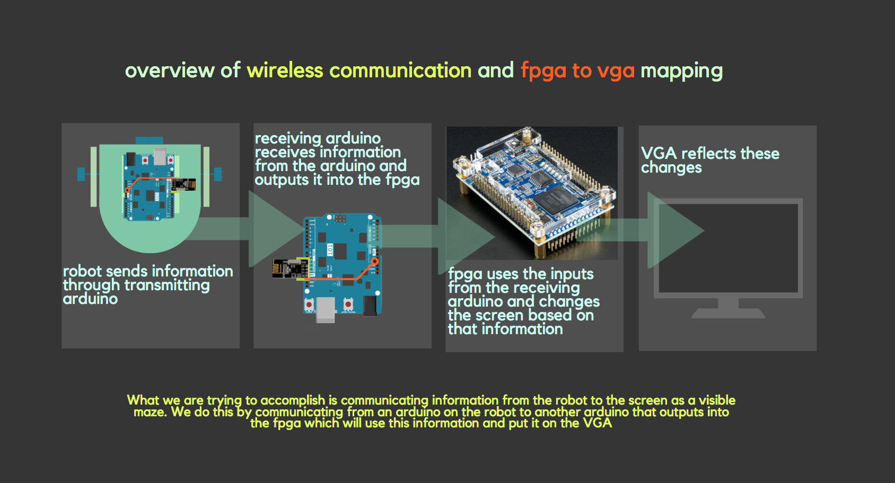

## Radio Team

The main goals of radio team are:
* Sending information wirelessly between Arduino’s
* Sending the entire maze wirelessly
* Updating the maze array, dependent only on the updated robot information

Materials:
* 2 Nordic nRF24L01+ transceivers
* 2 Arduino Unos (one must be shared with the other sub-team)
* 2 USB A/B cables
* 2 radio breakout boards with headers

nRF24L01+: 
* is a wireless communication device
* is low cost 2.4GHz tranceiver ( transmitter + receiver) which as a built in antenna
* communicates with Arduino using Serial Peripheral Interface (SPI) which is a data protocol used by microcontrollers for communicating with one or more peripheral devices quickly over short distances 
* has communication addresses are called pipes

For more info check out this [Website](https://www.nordicsemi.com/eng/Products/2.4GHz-RF/nRF24L01P).



# Sending information wirelessly between Arduino’s
* We started by downloading and installing the [RF24 Arduino library](https://github.com/maniacbug/RF24) and updated the getting started sketch from the 3400 course website.
* Then we set up the radio, we used the two level-converters and soldered a wire to 3.3 power pin and connected it to the 3.3V on the arduino.
* We assigned the address number for the two pipes using the formulae below : in this case they represent the address of transmitter(0) and receiver(1). 

     2(3D + N) + X: D=4 for friday, N=16 team number, X=0 for radio 1 , X=1 for radio 2

* #### _Sender-> has 0_
  #### _2(3*4+16)+0=56_
  #### _In hex: 38_

* #### _Receiver-> has 1_
  #### _2(3*4+16)+1=57_
  #### _In hex: 39_

The code implementation is shown below. Ping_out for and ping_back roles are used for sending data back and forth or acknowledgement purposes. 

* Writing: Only one pipe can be open at once

Parameter:

  address: The 40-bit address of the pipe to open.

* Reading: Up to 6 pipes can be open for reading at once
  
Parameter:
  
  number: Which pipe# to open 
    
  address: The 40-bit address of the pipe to open.

```arduino

// Radio pipe addresses for the 2 nodes to communicate.
const uint64_t pipes[2] = { 0x0000000038LL, 0x0000000039LL };
...

if ( role == role_ping_out ) 
  { // sending
    radio.openWritingPipe(pipes[0]);
    radio.openReadingPipe(1,pipes[1]);
  }
  else
  { // role_ping_back to sender
    radio.openWritingPipe(pipes[1]);
    radio.openReadingPipe(1,pipes[0]); 
}
...


```

# Sending the entire maze wirelessly

For this part, we wanted to send a 4X5 matrix representing the maze from one arduino and receive it correctly on the other.
The maze we used was the following, added near the top of the code:

```arduino
unsigned char maze[5][4] =
{
  3, 3, 3, 3,
  3, 1, 1, 1,
  3, 2, 0, 1,
  3, 1, 3, 1,
  0, 0, 0, 0,
};
```
Using similar code to when we sent the unsigned long, we sent the maze using the following code. Note that this occurs within role 


```arduino
printf("Now sending the maze!\n");
bool ok = radio.write( maze, sizeof(maze) );

if (ok)
  printf("ok...");
else
  printf("failed.\n\r");
  ```
  
On the receiving end we

## Graphics Team
* Displaying a full 4-by-5 grid array on the screen
* Communicating maze information from the Arduino to the FPGA
* Display the robot location on the screen
* Distinguish what sites have been visited and which haven’t on the screen
