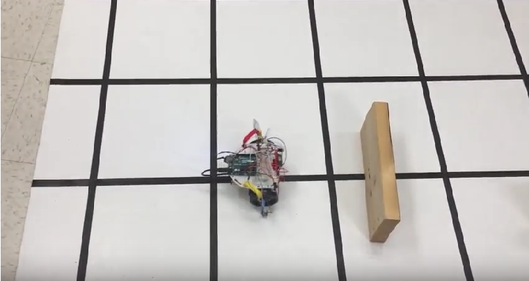

Much of what we've done in the treasure detection part of this milestone was covered in the [second lab](https://lois-lee.github.io/Team-16/docs/lab2/lab2.html). Here is a recap of what we did in lab2 for treasure detection. 

* The main objective is to detect signals with 7, 12 and 17 KHz frequency. 

* A treasure board with ajdustable IR intensity was used as the source for the frequencies, and a phototransistor circuit connected to the Uno was used to detect the frequencies.

* Once the fft analysis is done we read the values from the array which contains the amplitude of the signals. The bins for the three frequencies were identified to be in the follwing range. 

| Frequency     | Bins          |
| ------------- | ------------- |
| 7 kHz         | 45, 46, 47    |
| 12 kHz        | 79, 80, 81    |
| 17 kHz        | 113, 114, 115 |

```arduino  
  if(fft_log_out[i]>60){
        Serial.print(fft_log_out[i]);
        if(i>=45 && i<=47){
          range7++;
        }
        if(i>=79 && i<=81){
          range12++;
        }
        if(i>=113 && i<=115){
          range17++;
        }
      } 
      Serial.print(" ");
    }
    
    
    if(range7>0 && range7>range12 &&range7>range17){
      Serial.println("7 kHz");
    }
    else if(range12>0 && range12>range7 &&range12>range17){
      Serial.println("12 kHz");
    }
    else if(range17>0 && range17>range12 &&range17>range7){
      Serial.println("17 kHz");
    }
    else{
      Serial.println("none");
    }
```


The wall detection is done using a proximity sensor [datasheet](http://www.sharp-world.com/products/device/lineup/data/pdf/datasheet/gp2y0a41sk_e.pdf). It emits an infrared radiation and looks for a change in filed/signal. If the object is outside the nominal range of the sensor then there is no change in field. If not the sensor generates voltage that corresponds to the detected distance of the object. 

We added the short range distance sensing implementation to our previous from lab2. A digital pin was used to take input from the wall sensor. If the wall sensor detects a wall, we write 90 to the robots to stop them. This is shown below in the demo video. 

<iframe width="420" height="315"
src="https://youtu.be/n05xAf3Eazs">
</iframe> 

 <iframe width="420" height="315"
src="https://www.youtube.com/embed/XGSy3_Czz8k">
</iframe> 


[](https://youtu.be/n05xAf3Eazs)

For the future, we will also add the wall sensors to the sides of the robot which will assist the navigation of the robot along with the side line sensors. 


