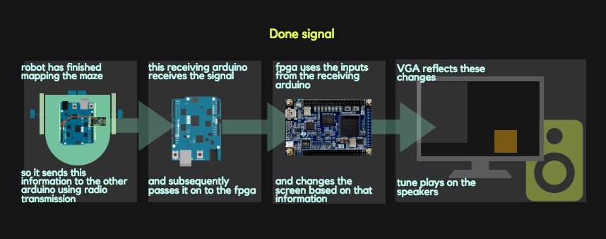

# Milestone 4

The purpose of this milestone was to put all of the parts together. This mainly included adding the dfs code from the previous to the radio transmission code for the arduino on the robot's side, and adding the radio receiving code to the fpga vga code. 

The way we implemented our dfs incorporated a separate visited matrix, separate wall matrix and the robot's x and y position. Thus we added a simple helper function to shift the bits from each part and add them together to create our 16 bits of information

[Watch the demo here!](https://www.youtube.com/watch?v=baXOMfLAL1I)

# Displaying walls
In order to display the walls on the FPGA the first thing we need is to set up the SPI transmission from the Arduino. The Arduino sends a 16 bit signal to the FPGA. 
  * The first 2 bits represent X axis position (0,1,2,3) and next three bits represent Y axis position ( 0,1,2,3,4) for drawing the 4     by 5 maze
  * The next three bits represent the state of the robot such as current state, visited, unvisited, treasures (7kHz,12kHz,17kHz)
  * The next four bits represent the 4 possible positions of walls ( north, south, east, west)
  * The last bits are not used or this milestone but we will use them in our final implementation
  
  
  
  
 In order to recevie data from the Arduino, we added another FPGA code that receives each bit sent from the Arduino, and stores them in an out variable that is used in the DE0_NANO.v code to draw the maze.
 ```verilog
 module RECEIVE (
	CLOCK,
	DATA,
	ENABLE,
	OUT
);

...
always @(posedge CLOCK) begin
  if(ENABLE) begin
  	accumulate[index] <= DATA;
	if(index == 4'b1111) begin
	     pastOut <= accumulate;
	end
	else begin
	    pastOut <= 16'b1111111111111111;
	end
	index <= index + 1;
	end
  end
 ```
# Displaying treasures

We had already previously programmed the FPGA to change colors depending on the bits allocated for treasure on the 16 bit information from the arduino. Thus we merely had to test it out using the 
 
# Signalling done

When the robot finishes mapping the maze, it has to send a signal to the separate arduino connected to the FPGA. We want to signal that the robot has finished on both the visual display as well as by our finished tune.

Below is a visual of how the process should work.

 

We allocated a separate signal for the done. The arduino on the robot will set this signal high once it has finished, and send it to the arduino which will then send it to the fpga. We coded the FPGA to draw an orange square on the outside of the matrix once it has finished and also start the tune.

# Simulation for Signaling "done" and detecting Treasures
For showing the done signal first we made a simple simulation code that changes the current position on the maze as if the robot was moving. 
